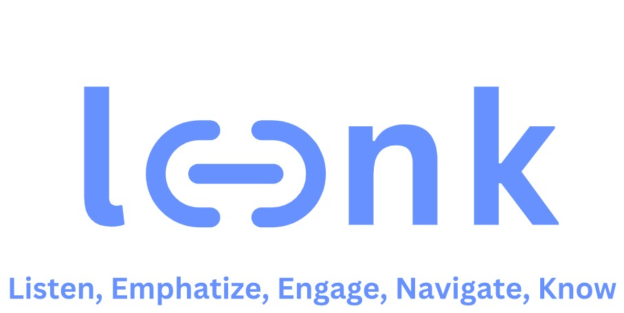

# Leenk - AI-Mediated Care Communication


## Overview
Leenk (Listen, Empathize, Engage, Navigate, Know) uses AI to enhance communication between caregivers and elderly patients. Built by Electric Minds, a non-profit focused on cross-organizational collaboration to solve global challenges, Leenk specifically addresses Singapore's aging population crisis.

While developed for the OpenAI x GovTech Hackathon 2024, Leenk is part of Electric Minds' broader initiative on elderly care and cultural preservation. Our focus is impact over profit - addressing real needs in elderly care through practical AI applications.



## Hackathon Demo: AI-Enhanced Care Dialogue
Our hackathon prototype demonstrates how Leenk mediates communication while considering health data, appointments, and emotional states:

```
[System Context via API Call]
- Blood pressure reading (10 AM): 150/95 (Elevated)
- Calendar: SGH Cardiology appointment tomorrow, 2 PM, Level 3
- Recent logs: Missed medication 2x this week
- Caregiver stress level: Elevated (based on voice analysis)

Caregiver: "Ah Kong, did you take your medicine today?"
Patient: "Don't want lah... every day take for what?" (in Hokkien)

[Leenk to Caregiver - private audio channel]
"Notice: Ah Kong's blood pressure is high today. Try a gentler approach. 
Suggested response: 'I know it's frustrating, but remember tomorrow's heart doctor appointment?'"

Caregiver: "I understand it's frustrating. Remember we're seeing Dr. Tan tomorrow? We want your blood pressure to be better when we visit."

Patient: "Tomorrow doctor ah? Where?" (in Hokkien)

[Leenk to Both]
"Appointment details: SGH Cardiology, tomorrow 2 PM, Level 3"

[Leenk to Caregiver]
"Good timing to discuss medication. Stress levels in both voices decreasing."

Caregiver: "Yes, at SGH. Shall we take your medicine now so we have good news for Dr. Tan?"

Patient: "Okay lah... you help me check which one ah?" (in Hokkien)

[Leenk displays medication schedule and images]
```

### Code

#### Mock API for sensor and context data

[FastAPI Implementation](leenk-api/README.md )

```json
{
    "vital_signs": {
        "blood_pressure": {
            "reading": "155/90",
            "time": "10:00 AM",
            "status": "High"
        }
    },
    "calendar": {
        "event": "Cardiology appointment",
        "datetime": "02:30 PM",
        "location": "SGH Cardiology, Level 3"
    },
    "medical_logs": {
        "medication_adherence": "Missed medication 2x this week"
    }
}
```

### Technologies
- OpenAI Realtime API (o1-preview model)
- TypeScript
- WebSocket for real-time communication
- Speech-to-speech processing
- Health device integrations
- Calendar synchronization

## Project Timeline

### Phase 0: Foundation (October 2024)
- Initiative launch by Rex Lam and Daphne Sim
- Initial research on cultural preservation
- Stakeholder engagement with elderly care organizations
- Framework for AI literacy programs

### Phase 1: Hackathon (November 22, 2024)
- Core communication mediation prototype
- Real-time health data integration
- Multilingual support with dialect understanding
- Basic caregiver stress monitoring
- [Sumitted idea](submitted-idea.md)

### Phase 2: Ecosystem Building (From January 2025)
- Building collaborative network of:
  - Medical professionals
  - Healthcare institutions
  - Private enterprises
  - Community volunteers
  - Elderly care organizations
- Development of governance framework
- Integration of stakeholder feedback
- Expansion of features based on real-world needs

## Vision & Features

### Current Features
- Real-time language translation and dialect support
- Context-aware conversation mediation
- Health data integration
- Appointment management
- Medication tracking
- Caregiver stress monitoring

### Planned Features
- Comprehensive vital signs monitoring
- Predictive health alerts
- Community support network
- Mental wellness tracking
- Cultural wisdom preservation
- Remote family participation
- Emergency response system
- Healthcare provider portal

---

Built with ❤️ by Electric Minds  

*Note: This project is part of Electric Minds' broader initiative to preserve cultural wisdom and enhance elderly care through responsible AI innovation.*